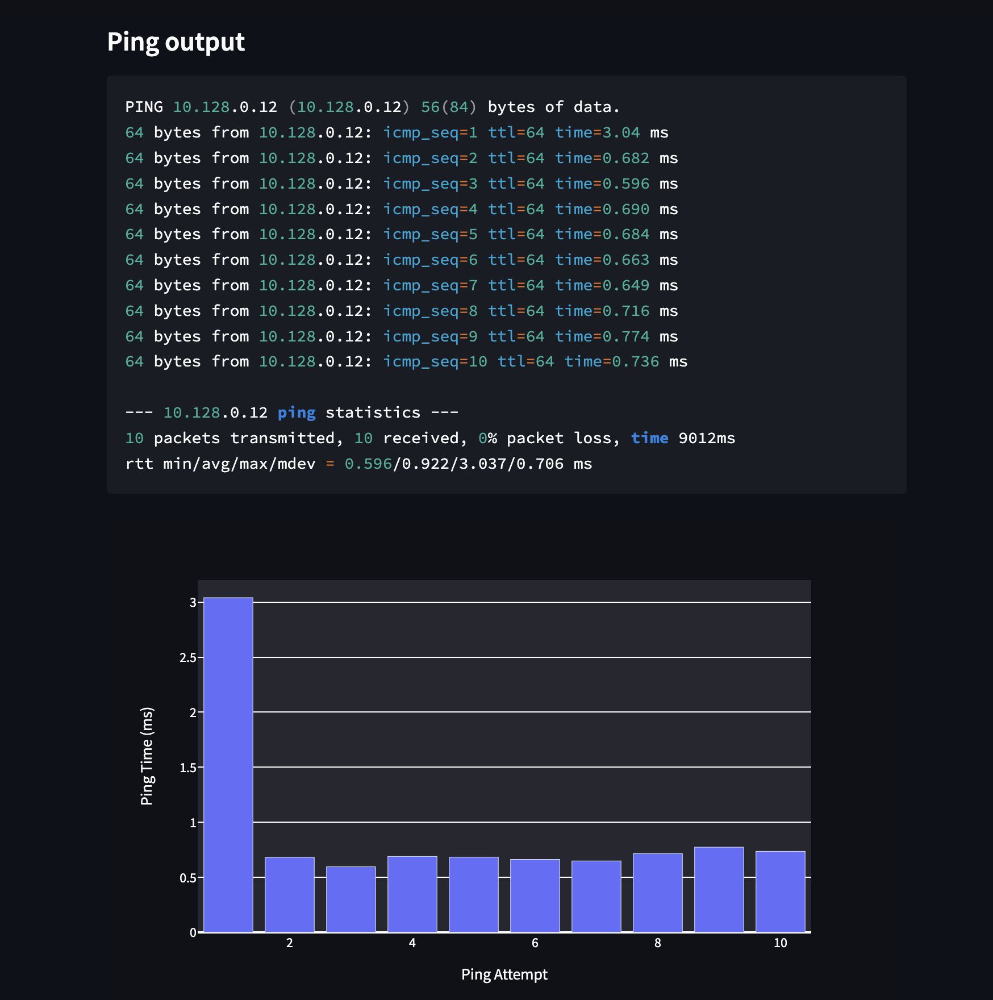

# Serverless VPC Access Diagnostic Tools

Forked version from  [GoogleCloudPlatform/vpc-network-tester](https://github.com/willypalacin/vpc-network-tester.git)https://github.com/willypalacin/vpc-network-tester.git

This repository contains a Google Cloud Run service that is deployable in a customer's project to diagnose and debug the configuration of serverless networking for the serverless services including the VPC Access connectors and Direct VPC Egress feature in the customer's project.

To deploy full scenario using Serverless Access Connector or VPC Direct Egress using Cloud Run, please refer to the following [repo](https://github.com/javiercanadillas/cloudrun-direct-vpc-egress)

## Installation 
Make sure you have a shell environment with `gcloud` and `git`

0. Authorize to use the Google Cloud SDK
```bash
gcloud auth login
```
1. Variable definition

```bash
export PROJECT_ID=<PROJECT_ID>
export REGION=<REGION>
export VPC_NAME=<VPC_NAME>
export SUBNET=<SUBNET_NAME>
```

2. Clone this repo 
```bash
git clone https://github.com/willypalacin/vpc-network-tester
```
3. Create a container image repository
```
gcloud artifacts repositories create cloud-run-lab \
--repository-format=docker \
--location=$REGION --description="Docker repo for cloud run serverless"
```
4. Build the image and push it to container registry
```bash
cd cloudrun
gcloud builds submit -t $REGION-docker.pkg.dev/$PROJECT_ID/cloud-run-lab/network-tester . 
```
5. Deploy to Cloud Run  (using direct VPC egress feature)
```bash
gcloud beta run deploy direct-vpc-egress-service \
  --image="${REGION}-docker.pkg.dev/${PROJECT_ID}/cloud-run-lab/network-tester" \
  --network=$VPC_NAME \
  --subnet="$SUBNET" \
  --network-tags=service-direct-egress \
  --region=$REGION \
  --vpc-egress=private-ranges-only \
  --allow-unauthenticated
```

## Usage

This application presents a simple HTML UI on it's '/' path. Point a browser at this Cloud Run  reported from either gcloud run deploy or command above to interact with the user interface. This currently presents the ability to diagnose HTTP(s) GET an arbitrary URL, ICMP ping an arbitrary host or IP address, or run iperf3 client against an arbirary host.

In order to use iperf3, you must have an iperf3 server running on the host specified. 

### Example of metrics using PING

For this particular case we have the Cloud Run service deployed and a GCE instance with a private IP of `10.128.0.12`




As shown in the image, we can verify the output of a ping from the interface as well as the bar chart showing the ms it took in each one of the attempts. 
